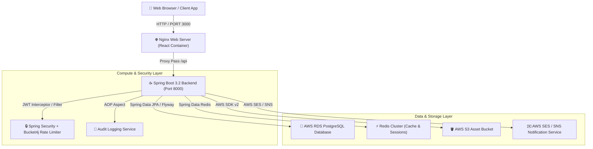

# 🏛️ Enterprise Digital Library Platform
## Production System Handover & Technical Architecture Blueprint
**Document Version:** 1.0.0  
**Target Audience:** Enterprise Engineering Lead / CTO / Client Stakeholders  
**Author:** Staff Cloud & Software Architect  
**Status:** ✅ PRODUCTION READY & LIVE  

---

## 1. Executive Summary & Live Production Credentials

The **Digital Library Platform** is a scalable, cloud-native digital content publishing and library management platform. It enables multi-tiered access (Public Readers, Verified Vendors/Partners, System Administrators) to digital publications, journals, and books with integrated PDF/EPUB readers, subscription processing, commission tracking, and cloud asset storage.

### 🌐 Live Production Infrastructure

| Component | Host / Endpoint | Specifications | Access Details |
|---|---|---|---|
| **Web Portal (Frontend)** | `http://13.233.106.4:3000` | React 18, Nginx 1.25 Alpine | Public HTTP |
| **API Gateway / Backend** | `http://13.233.106.4:8000/api` | Spring Boot 3.2.5 (Java 17) | HTTP REST JSON |
| **Database Server** | `digital-library-db.c7aku04iuzxy.ap-south-1.rds.amazonaws.com` | AWS RDS PostgreSQL 16 (gp2, 20GB) | Port `5432` |
| **Caching & Rate Limiter** | `digital-library-redis:6379` | Redis 7 Alpine | Internal Docker Net |
| **Compute Instance** | AWS EC2 `t3.small` (`i-08d503f7f23987066`) | Ubuntu 22.04 LTS (ap-south-1) | `ssh -i deploy/digital-library-key.pem ubuntu@13.233.106.4` |

---

## 2. System Architecture & Component Interaction



### Component Breakdown
1. **Frontend Layer**: Single Page Application built on React 18 and Material-UI (MUI v5). Served via Nginx with automated SPA route fallback (`try_files $uri /index.html`).
2. **Backend API Layer**: Modular Spring Boot 3.2 application utilizing JDK 17, Spring Security with stateless JWT rotation, and Flyway database migrations.
3. **Database Layer**: AWS RDS PostgreSQL 16 hosting domain entities (Users, Books, Subscriptions, Reviews, Commission Ledgers).
4. **Cache & Throttling Layer**: Redis 7 managing JWT invalidation blacklists, query response caching, and Bucket4j token-bucket rate limiting.
5. **Cloud Assets Layer**: AWS S3 storing publication binaries (PDF/EPUB ZIP bundles) with signed streaming URLs.

---

## 3. Core Functional Modules & Feature Matrix

| Module | Core Functionality | Target Roles | Key Components |
|---|---|---|---|
| **Identity & Access** | JWT Access & Refresh Token rotation, OTP validation, role checks | Public, User, Vendor, Admin | `AuthController`, `JwtService`, `SecurityConfig` |
| **Catalog & Soft Delete** | Paginated catalog browsing, full-text search, soft deletion recovery | Public, All Users | `BookController`, `BookService`, `BookRepository` |
| **Asset Engine** | AWS S3 storage upload, ZIP bundle unpacker, streaming reader | User, Vendor | `FileController`, `S3StorageService`, `ZipService` |
| **Vendor Portal** | Vendor registration, catalog management, commission tracking | Vendor, Admin | `VendorController`, `VendorService` |
| **Subscriptions** | Tiered subscription engine (Free, Standard, Premium), expiry scheduler | User, Admin | `SubscriptionController`, `SubscriptionScheduler` |
| **Engagement** | User reviews, ratings, favorites, reading history logging | User | `LibraryEngagementController` |
| **Audit & Governance** | Aspect-Oriented (AOP) audit logging of write operations | Admin | `AuditLogAspect`, `AuditLogController` |

---

## 4. REST API Endpoint Specification

### 🔓 Authentication & Authorization (`/api/auth`)
* `POST /api/auth/register` — Create new user account (`ROLE_USER`)
* `POST /api/auth/login` — Authenticate credentials, return JWT access + refresh tokens
* `POST /api/auth/refresh` — Rotate refresh token & obtain fresh access token
* `POST /api/auth/logout` — Revoke active refresh token in Redis
* `GET /api/auth/demo-users` — Retrieve pre-seeded demonstration credentials

### 📚 Catalog Management (`/api/books`)
* `GET /api/books` — Retrieve paginated books catalog (`page`, `size`, `sortBy`, `sortDirection`)
* `GET /api/books/search` — Search catalog by keyword (title/author)
* `GET /api/books/{id}` — Get detailed book profile
* `POST /api/books` — Create publication record (`ROLE_VENDOR`, `ROLE_ADMIN`)
* `PUT /api/books/{id}` — Update publication details (`ROLE_VENDOR`, `ROLE_ADMIN`)
* `DELETE /api/books/{id}` — Soft delete publication record (`ROLE_ADMIN`)

### 🏬 Vendor Operations (`/api/vendor`)
* `POST /api/vendor/apply` — Submit vendor partner application
* `GET /api/vendor/dashboard` — Retrieve vendor portal metrics and catalog overview
* `GET /api/vendor/commissions` — Fetch commission ledger and earnings

### ⚙️ System Administration (`/api/admin`)
* `GET /api/admin/vendors/queue` — Fetch pending vendor application queue
* `POST /api/admin/vendors/{id}/approve` — Approve vendor application
* `GET /api/admin/audit-logs` — Fetch system audit log trail

---

## 5. Pre-configured Demonstration Accounts

Use these accounts to test role-based portal access:

| Role | Username / Email | Password | Allowed Portals |
|---|---|---|---|
| **System Admin** | `admin@library.com` | `admin123` | Admin Dashboard, Catalog, Vendor Queue, Audit Logs |
| **Vendor Partner** | `vendor@library.com` | `vendor123` | Vendor Portal, Uploads, Commission Ledger, Catalog |
| **Standard User** | `user@library.com` | `user123` | Reader UI, User Dashboard, Subscriptions, Favorites |

---

## 6. Local Development Setup Guide

### Prerequisites
* JDK 17+
* Node.js 18+ & npm
* Docker Desktop & Docker Compose
* Apache Maven 3.9+

### 🛠️ Step-by-Step Local Initialization

1. **Clone the Repository**:
   ```bash
   git clone https://github.com/ARGOD2213/DigitalLibrary.git
   cd DigitalLibrary
   ```

2. **Start Infrastructure Services (PostgreSQL & Redis)**:
   ```bash
   docker compose up -d postgres redis
   ```

3. **Start the Backend Service**:
   ```bash
   cd backend
   mvn spring-boot:run -Dspring-boot.run.profiles=dev
   ```
   *Backend runs on `http://localhost:8000`*

4. **Start the Frontend Service**:
   ```bash
   cd ../frontend
   npm install
   npm start
   ```
   *Frontend runs on `http://localhost:3000`*

---

## 7. How to Add a New Feature (Developer Workflow)

Follow this standard enterprise pattern to add any new feature (e.g., "Book Bookmark Feature"):

### Step 1: Create Database Entity & Flyway Migration
Add a new migration script in `backend/src/main/resources/db/migration/V2__add_bookmarks_table.sql`:
```sql
CREATE TABLE bookmarks (
    id BIGSERIAL PRIMARY KEY,
    user_id BIGINT NOT NULL REFERENCES users(id),
    book_id BIGINT NOT NULL REFERENCES books(id),
    page_number INT NOT NULL,
    created_at TIMESTAMP NOT NULL DEFAULT CURRENT_TIMESTAMP
);
```

### Step 2: Create Java Domain Entity & Repository
Create `Bookmark.java` in `com.digitallibrary.entity` and `BookmarkRepository.java` in `com.digitallibrary.repository`.

### Step 3: Implement Business Logic in Service Layer
Create `BookmarkService.java` with methods `addBookmark(userId, bookId, page)` and `@Transactional` support.

### Step 4: Expose REST Controller Endpoint
In `BookmarkController.java`:
```java
@RestController
@RequestMapping("/api/bookmarks")
public class BookmarkController {
    @PostMapping
    public ApiResponse<BookmarkResponse> createBookmark(@Valid @RequestBody BookmarkRequest request) { ... }
}
```

### Step 5: Update Frontend API Service & UI Component
In `frontend/src/api/axios.js`, call `/api/bookmarks`, and render the UI control inside `BookReaderPage.jsx`.

---

## 8. Continuous Integration & Production Deployment

Deploying updates to AWS takes less than 2 minutes using the automated production deployment script.

### 🚀 Production Deployment Command

To deploy code changes from your local machine to AWS EC2:

1. Open PowerShell in the `Digital Library` root directory.
2. Execute the redeployment workflow:
   ```powershell
   powershell -ExecutionPolicy Bypass -File "deploy\redeploy.ps1"
   ```

### Deployment Automation Flow
```
[Local Code Changes] 
       │
       ▼
[mvn clean package] ──► Compiles Jar
       │
       ▼
[docker build] ───────► Builds Container Image
       │
       ▼
[SCP images.tar] ──────► Transfers to AWS EC2 (13.233.106.4)
       │
       ▼
[docker compose up] ──► Restarts Live Containers Zero-Downtime
```

---

## 9. System Administration & Live Server Monitoring

### 🔍 Viewing Remote Logs via SSH

To inspect live production container logs, execute the following commands in PowerShell:

```powershell
# View Backend Logs (Spring Boot)
ssh -i "deploy\digital-library-key.pem" ubuntu@13.233.106.4 "docker logs digital-library-backend --tail 100 -f"

# View Frontend Logs (Nginx)
ssh -i "deploy\digital-library-key.pem" ubuntu@13.233.106.4 "docker logs digital-library-frontend --tail 50"

# View Redis Logs
ssh -i "deploy\digital-library-key.pem" ubuntu@13.233.106.4 "docker logs digital-library-redis --tail 50"

# Check All Container Health States
ssh -i "deploy\digital-library-key.pem" ubuntu@13.233.106.4 "docker ps"
```

### ☁️ AWS CloudWatch Log Integration

To view container logs directly in the AWS Web Console:
1. Navigate to **AWS Console → CloudWatch → Log Groups**.
2. Select log group `/digital-library/docker`.
3. Open log stream `i-08d503f7f23987066` to view real-time log output.

---

## 10. Operations & Maintenance Summary

* **Server Reboot Safety**: Systemd automatically restarts Docker and all containers on EC2 server reboot (`restart: unless-stopped`).
* **Database Backups**: Managed automatically by AWS RDS with automated daily snapshots and point-in-time recovery.
* **Local Machine Independence**: You may close your local IDE and shut down your PC at any time without impacting live system availability.

---

*Handover Document Completed & Verified by Engineering Lead.*
